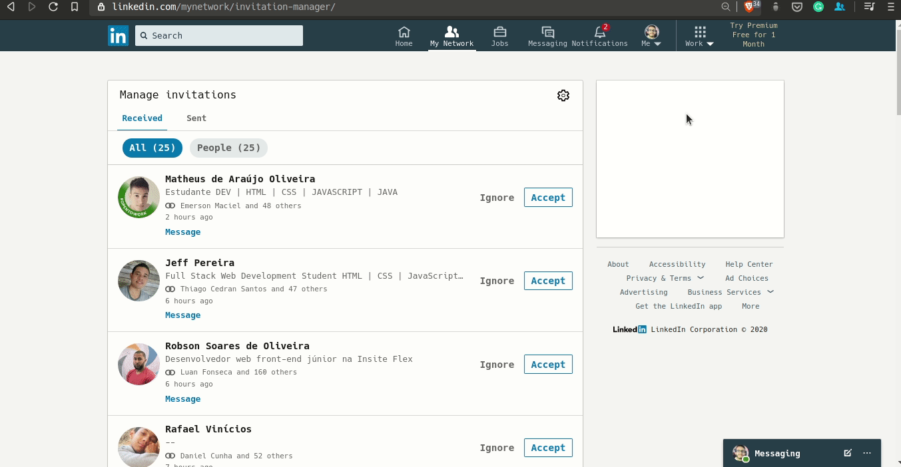

<div align="center">	
		
</div>

<div align="center">
	<h1>Accept Conections LinkedIn 💾</h1>
</div>

### What is? 🏛️
A chrome extension to accept multiples LinkedIn connections request.
<hr>

### Which technologies were used? 💻
- HTML
- CSS
- JavaScript
<hr>

### How it works? ⚙️

<hr>

### How can I use this extension? ▶️
- Clone this repository
```bash
$ git clone https://github.com/felipejsborges/accept-connections-linkedin-extension.git
```

- Open your Chrome Web Browser

- [Go to Extension Management](chrome://extensions)

- Toggle to enable Developer mode

- Click on Load Unpacked button

- Select the repository directory

- Load Extension
<hr>

by Felipe Borges<br>
[LinkedIn](https://www.linkedin.com/in/felipejsborges) | [GitHub](https://github.com/felipejsborges)
